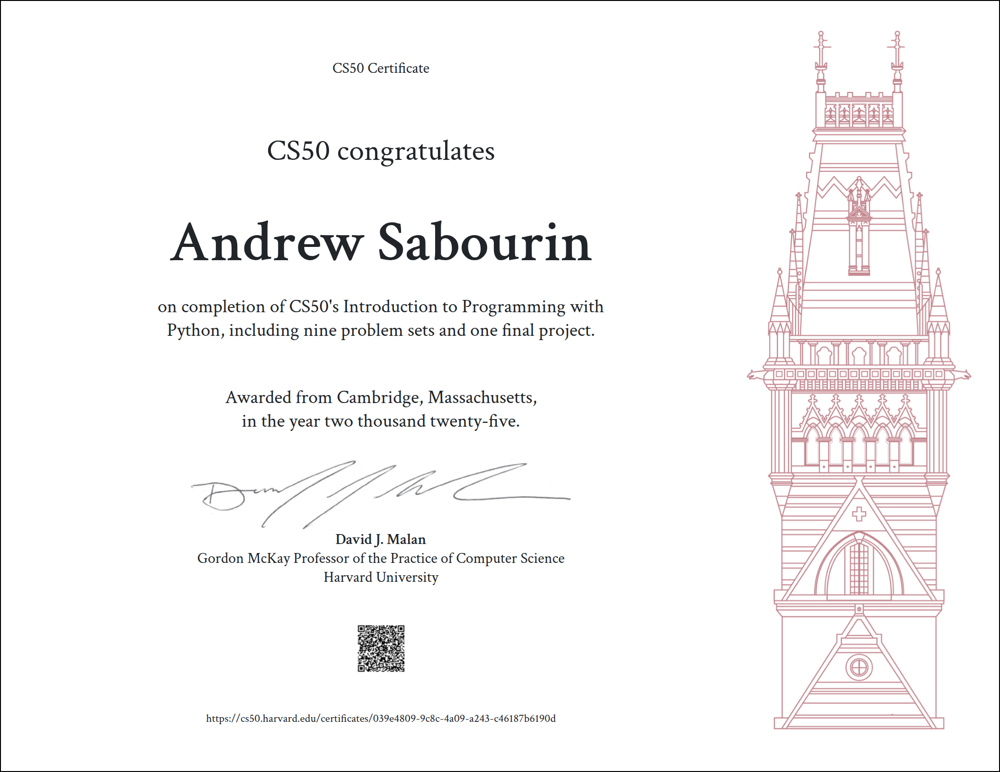

# Python
CTEC 121 CS50P – Introduction to Programming with Python



> Completed as part of Harvard's CS50P curriculum, offered through **Clark College** (Winter Quarter).

---

## About This Course

CS50's Introduction to Programming with Python is Harvard University's introductory course for people who have little or no prior programming experience. The course covers Python fundamentals through a series of progressively challenging problem sets.

**Institution:** Clark College  
**Term:** Winter Quarter  
**Certificate:** Earned **09/14/25**

---

## Repository Structure

Each folder corresponds to a week/unit of the course and contains my solutions to the problem sets.

```
cs50p/
├── week0/(./week0)        # Functions, Variables
├── week1/(./week1)        # Conditionals
├── week2/(./week0)        # Loops
├── week3/(./week0)        # Exceptions
├── week4/(./week0)        # Libraries
├── week5/(./week0)        # Unit Tests
├── week6/(./week0)        # File I/O
├── week7/(./week0)        # Regular Expressions
├── week8/(./week0)        # Object-Oriented Programming
└── final/(./W25_final)        # Final Project
```

---

## Topics Covered

- Functions & Variables
- Conditionals & Loops
- Exception Handling
- Working with Libraries (`random`, `sys`, `requests`, etc.)
- Unit Testing with `pytest`
- File I/O (reading/writing CSV, text files)
- Regular Expressions
- Object-Oriented Programming
- Final Project

---

## Certificate

I successfully completed the course and earned a verified certificate from CS50/Harvard.

---

## Notes

All solutions are my own work or with help from instructor, written during the course. This repository serves as a portfolio of my progress learning Python.

---

*Thanks to the CS50 team at Harvard and Clark College for an excellent course!*